# InternLM2-Tutorial-Assignment-Lecture6
# Lagent & AgentLego 智能体应用搭建    
2024.4.17   Lagent&AgentLego 核心贡献者 樊奇   

[Lagent](https://github.com/InternLM/Lagent)    
[AgentLego](https://github.com/InternLM/AgentLego)   

[第6课 视频](https://www.bilibili.com/video/BV1Xt4217728/)    
[第6课 文档](https://github.com/InternLM/Tutorial/tree/camp2/agent)    
[第6课 作业](https://github.com/InternLM/Tutorial/blob/camp2/agent/homework.md)    


论文：    
[Agent-FLAN 技术报告](https://arxiv.org/abs/2403.12881)    
[Repo](https://github.com/InternLM/Agent-FLAN)    

# 第6课 笔记   

## 理论课程    

###  为什么要有智能体 

大语言模型存在局限性：
  - 幻觉: 模型可能会生成虚假信息、与现实严重不符或脱节。
  - 时效性： 模型训练数据过时，无法反映最新趋势和信息。
  - 可靠性问：面对复杂任务时，可能频发错误输出现象，影响信任度。

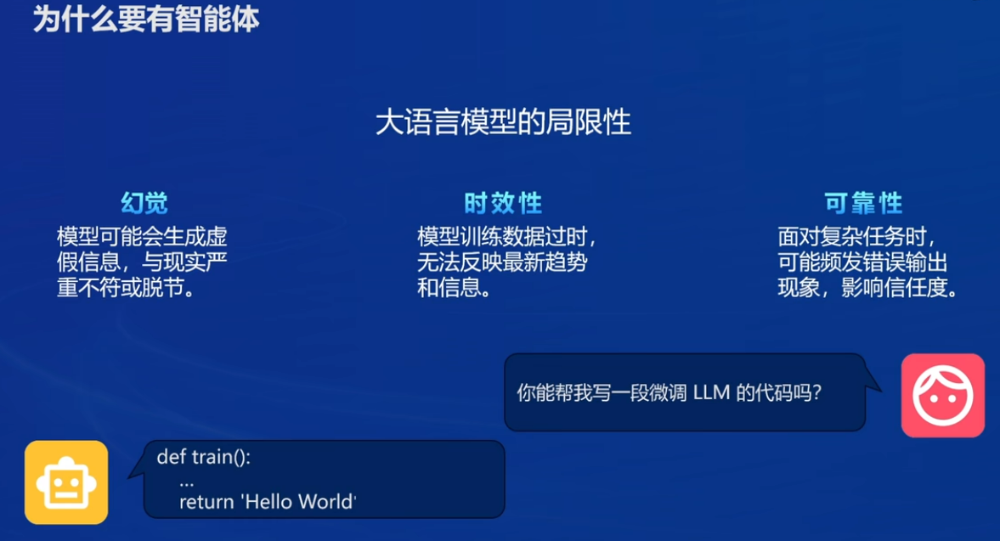       

### 什么是智能体          

智能体概念的第一次提出： Hayes-Roth 1995, An Architecture for Adaptive Intelligent Systems.    
一个智能体需要满足以下3个条件：     

1. Perception of dynamic conditions in the environment
可以感知环境中的动态条件。

2. Action to affect conditions in the environment
能采取动作影响环境。

3. Reasoning to interpret perceptions, solve problems, draw inferences, and determine actions.    
能运用推理能力理解信息、解决问题，产生推断、决定动作。

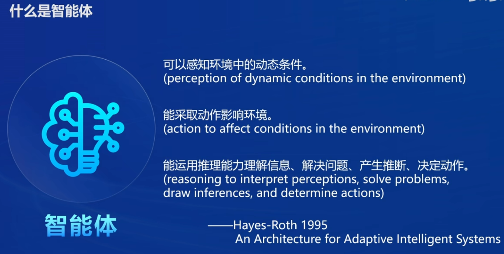 

智能体组成：    

  1. 大脑：作为控制器，承担记忆、思考和决策任务。接收来自感知和模块的信息，并采取相应动作。
     
  2. 感知：对外部环境的多模态信息进行感知和处理。包括但不限于图像、音频、视频、传感器等。
     
  3. 动作： 利用并执行工具以影响环境。工具可能包括文本的检索、调用相关API、操控机械臂等。

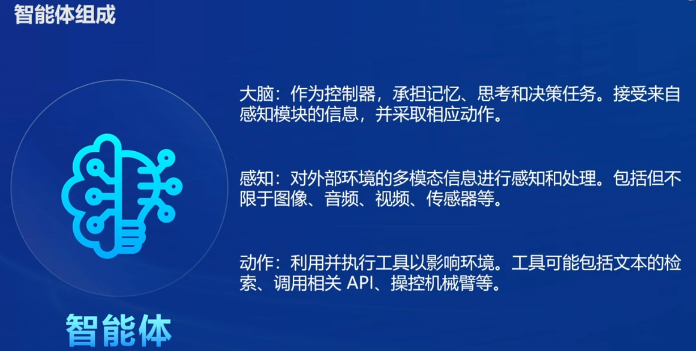     

### 智能体范式     
- AutoGPT
- ReWoo
- ReAct

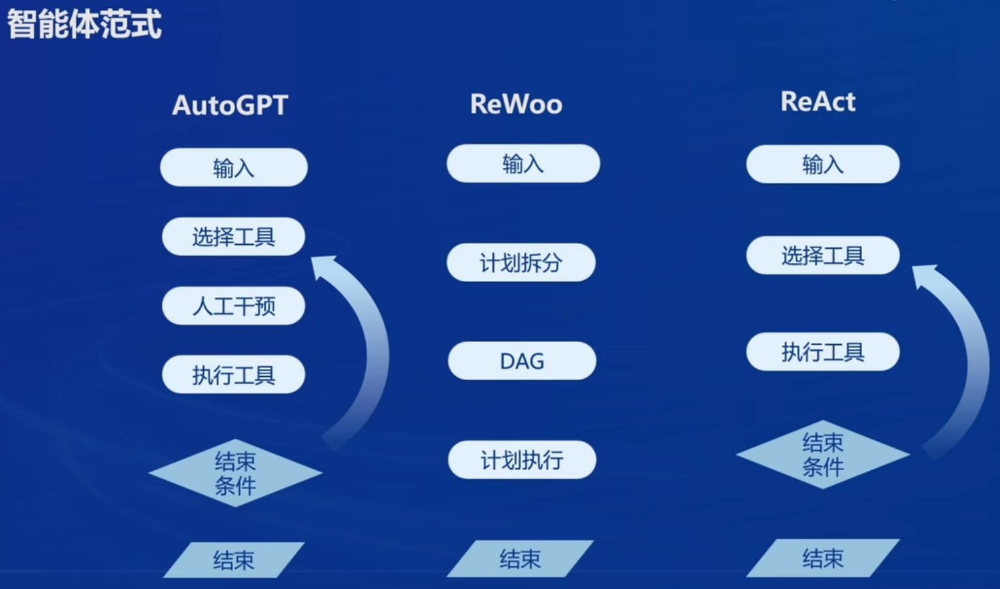 

### Lagent & AgentLego   

1. Lagent  

Lagent 是一个轻量级开源智能体框架，旨在让用户可以高效地构建基于大语言模型的智能体。同时它也提供了一些典型工具以增强大语言模型的能力。

Lagent 目前已经支持了包括 AutoGPT、ReAct 等在内的多个经典智能体范式，也支持了如下工具：

 - Arxiv 搜索
 - Bing 地图
 - Google 学术搜索
 - Google 搜索
 - 交互式 IPython 解释器
 - IPython 解释器
 - PPT
 - Python 解释器

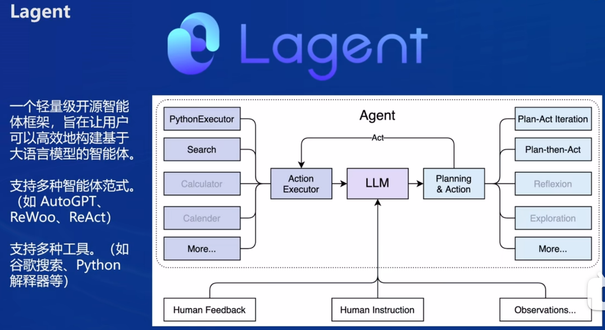 

2. AgentLego   

AgentLego 是一个提供了多种开源工具 API 的多模态工具包，旨在像是乐高积木一样，让用户可以快速简便地拓展自定义工具，从而组装出自己的智能体。通过 AgentLego 算法库，不仅可以直接使用多种工具，也可以利用这些工具，在相关智能体框架（如 Lagent，Transformers Agent 等）的帮助下，快速构建可以增强大语言模型能力的智能体。    

AgentLego 目前提供了如下工具：    

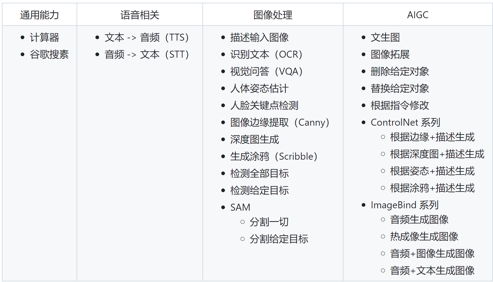 

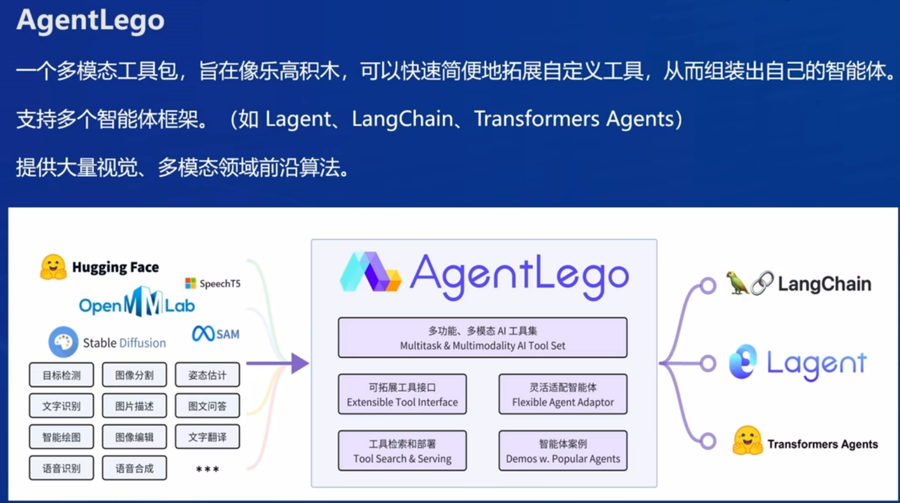    

3. Lagent 与 AgentLego 两者的关系

 Lagent 是一个智能体框架，而 AgentLego 与大模型智能体并不直接相关，而是作为工具包，在相关智能体的功能支持模块发挥作用。   

两者之间的关系可以用下图来表示：    

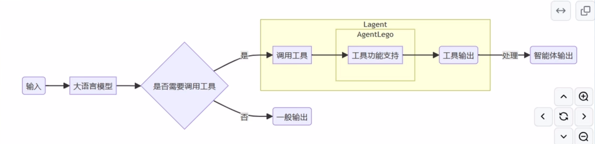

## Lagent & AgentLego 智能体应用搭建   

### 1. 环境配置      

1.1 创建开发机和 conda 环境    

创建开发机Agent: 选择镜像为` Cuda12.2-conda`，并选择 GPU 为`30% A100`。

进入开发机后，为了方便使用，我们需要配置一个环境以同时满足 Lagent 和 AgentLego 运行时所需依赖。在开始配置环境前，我们先创建一个用于存放 Agent 相关文件的目录，可以执行如下命令：  
```
mkdir -p /root/agent
```

开始配置 conda 环境，可以输入如下指令： 
```
studio-conda -t agent -o pytorch-2.1.2
```

显示下图就是初始化环境成功了。  

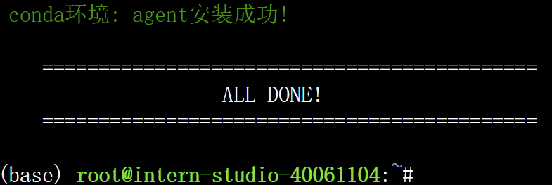    

1.2 安装 Lagent 和 AgentLego    

Lagent 和 AgentLego 都提供了两种安装方法，一种是通过 pip 直接进行安装，另一种则是从源码进行安装。为了方便使用 Lagent 的 Web Demo 以及 AgentLego 的 WebUI，我们选择直接从源码进行安装。 此处附上源码安装的相关帮助文档：   

- Lagent：https://lagent.readthedocs.io/zh-cn/latest/get_started/install.html
- AgentLego：https://agentlego.readthedocs.io/zh-cn/latest/get_started.html

执行如下命令进行安装：    

```
cd /root/agent
conda activate agent
git clone https://gitee.com/internlm/lagent.git
cd lagent && git checkout 581d9fb && pip install -e . && cd ..
git clone https://gitee.com/internlm/agentlego.git
cd agentlego && git checkout 7769e0d && pip install -e . && cd ..
```

1.3 安装其他依赖    

在这一步中，我们将会安装其他将要用到的依赖库，如 LMDeploy，可以执行如下命令：   

 ```
conda activate agent
pip install lmdeploy==0.3.0
```

1.4 准备 Tutorial    
由于后续的 Demo 需要用到 tutorial 已经写好的脚本，因此我们需要将 tutorial 通过 git clone 的方法准备好，以备后续使用：   

```
cd /root/agent
git clone -b camp2 https://gitee.com/internlm/Tutorial.git
```

### 2. Lagent：轻量级智能体框架    

在这一部分中，我们将体验 Lagent 的 Web Demo，使用 Lagent 自定义工具，并体验自定义工具的效果。    

详细文档可以访问：[Lagent：轻量级智能体框架](https://github.com/InternLM/Tutorial/blob/camp2/agent/lagent.md)    

**2.1 Lagent Web Demo**    

2.1.1 使用 LMDeploy 部署    

由于 Lagent 的 Web Demo 需要用到 LMDeploy 所启动的 api_server，因此我们首先按照下图指示在 vscode terminal 中执行如下代码使用 LMDeploy 启动一个 api_server。    

```
conda activate agent
lmdeploy serve api_server /root/share/new_models/Shanghai_AI_Laboratory/internlm2-chat-7b \
                            --server-name 127.0.0.1 \
                            --model-name internlm2-chat-7b \
                            --cache-max-entry-count 0.1
```

2.1.2 启动并使用 Lagent Web Demo    

接下来我们按照下图指示新建一个 terminal 以启动 Lagent Web Demo。在新建的 terminal 中执行如下指令：    

```
conda activate agent
cd /root/agent/lagent/examples
streamlit run internlm2_agent_web_demo.py --server.address 127.0.0.1 --server.port 7860
```

在等待 LMDeploy 的 api_server 与 Lagent Web Demo 完全启动后（如下图所示），在本地进行端口映射，将 LMDeploy api_server 的23333端口以及 Lagent Web Demo 的7860端口映射到本地。可以执行：

```
ssh -CNg -L 7860:127.0.0.1:7860 -L 23333:127.0.0.1:23333 root@ssh.intern-ai.org.cn -p 44315
```

|LMDeploy|Lagent Web Demo|
|---|---|
|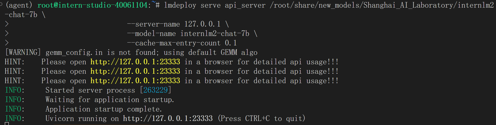||   

接下来在本地的浏览器页面中打开 `http://localhost:7860` 以使用 Lagent Web Demo。首先输入模型 IP 为 `127.0.0.1:23333`，在输入完成后按下回车键以确认。并选择插件为 `ArxivSearch`，以让模型获得在 arxiv 上搜索论文的能力。    

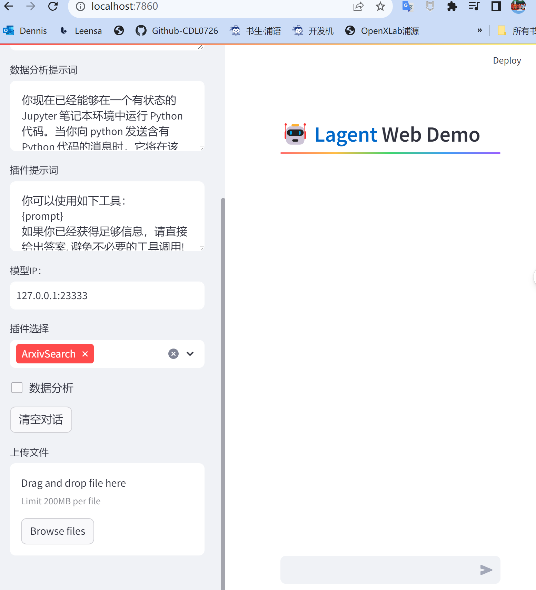

我们输入“请帮我搜索 InternLM2 Technical Report” 以让模型搜索书生·浦语2的技术报告。效果如下图所示，可以看到模型正确输出了 InternLM2 技术报告的相关信息。尽管还输出了其他论文，但这是由 arxiv 搜索 API 的相关行为导致的。    

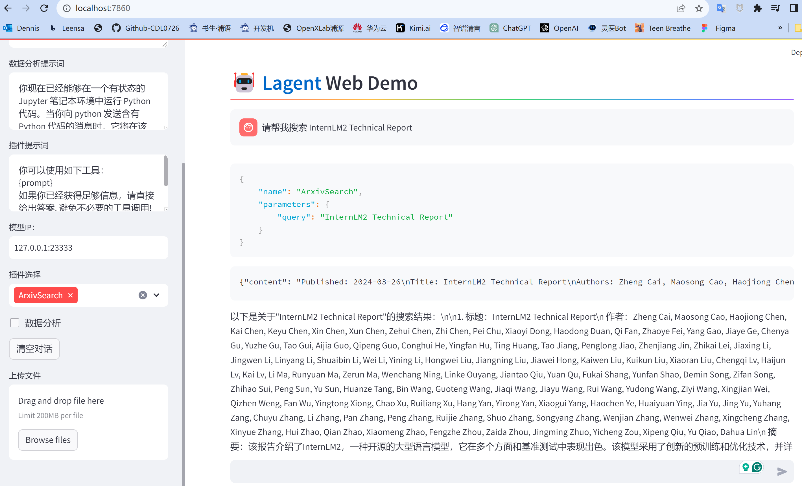     

还可以直接上传PDF压缩文件，然后让智能根据上传的文件来回答问题，并列出回答所引用的资料，效果如下：

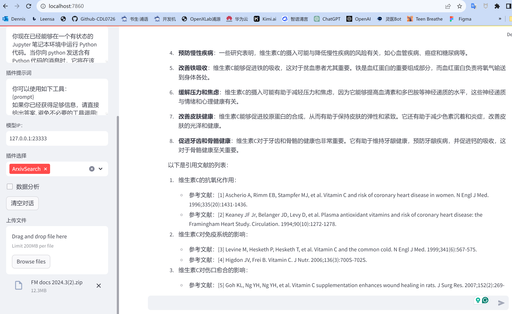  


**2.2 用 Lagent 自定义工具**   

在本节中，我们将基于 Lagent 自定义一个工具。Lagent 中关于工具部分的介绍文档位于 https://lagent.readthedocs.io/zh-cn/latest/tutorials/action.html 。使用 Lagent 自定义工具主要分为以下几步：

继承 BaseAction 类
实现简单工具的 run 方法；或者实现工具包内每个子工具的功能
简单工具的 run 方法可选被 tool_api 装饰；工具包内每个子工具的功能都需要被 tool_api 装饰
下面我们将实现一个调用和风天气 API 的工具以完成实时天气查询的功能。   

2.2.1 创建工具文件

首先通过 `touch /root/agent/lagent/lagent/actions/weather.py`（大小写敏感）新建工具文件，该文件内容如下：

```
import json
import os
import requests
from typing import Optional, Type

from lagent.actions.base_action import BaseAction, tool_api
from lagent.actions.parser import BaseParser, JsonParser
from lagent.schema import ActionReturn, ActionStatusCode

class WeatherQuery(BaseAction):
    """Weather plugin for querying weather information."""
    
    def __init__(self,
                 key: Optional[str] = None,
                 description: Optional[dict] = None,
                 parser: Type[BaseParser] = JsonParser,
                 enable: bool = True) -> None:
        super().__init__(description, parser, enable)
        key = os.environ.get('WEATHER_API_KEY', key)
        if key is None:
            raise ValueError(
                'Please set Weather API key either in the environment '
                'as WEATHER_API_KEY or pass it as `key`')
        self.key = key
        self.location_query_url = 'https://geoapi.qweather.com/v2/city/lookup'
        self.weather_query_url = 'https://devapi.qweather.com/v7/weather/now'

    @tool_api
    def run(self, query: str) -> ActionReturn:
        """一个天气查询API。可以根据城市名查询天气信息。
        
        Args:
            query (:class:`str`): The city name to query.
        """
        tool_return = ActionReturn(type=self.name)
        status_code, response = self._search(query)
        if status_code == -1:
            tool_return.errmsg = response
            tool_return.state = ActionStatusCode.HTTP_ERROR
        elif status_code == 200:
            parsed_res = self._parse_results(response)
            tool_return.result = [dict(type='text', content=str(parsed_res))]
            tool_return.state = ActionStatusCode.SUCCESS
        else:
            tool_return.errmsg = str(status_code)
            tool_return.state = ActionStatusCode.API_ERROR
        return tool_return
    
    def _parse_results(self, results: dict) -> str:
        """Parse the weather results from QWeather API.
        
        Args:
            results (dict): The weather content from QWeather API
                in json format.
        
        Returns:
            str: The parsed weather results.
        """
        now = results['now']
        data = [
            f'数据观测时间: {now["obsTime"]}',
            f'温度: {now["temp"]}°C',
            f'体感温度: {now["feelsLike"]}°C',
            f'天气: {now["text"]}',
            f'风向: {now["windDir"]}，角度为 {now["wind360"]}°',
            f'风力等级: {now["windScale"]}，风速为 {now["windSpeed"]} km/h',
            f'相对湿度: {now["humidity"]}',
            f'当前小时累计降水量: {now["precip"]} mm',
            f'大气压强: {now["pressure"]} 百帕',
            f'能见度: {now["vis"]} km',
        ]
        return '\n'.join(data)

    def _search(self, query: str):
        # get city_code
        try:
            city_code_response = requests.get(
                self.location_query_url,
                params={'key': self.key, 'location': query}
            )
        except Exception as e:
            return -1, str(e)
        if city_code_response.status_code != 200:
            return city_code_response.status_code, city_code_response.json()
        city_code_response = city_code_response.json()
        if len(city_code_response['location']) == 0:
            return -1, '未查询到城市'
        city_code = city_code_response['location'][0]['id']
        # get weather
        try:
            weather_response = requests.get(
                self.weather_query_url,
                params={'key': self.key, 'location': city_code}
            )
        except Exception as e:
            return -1, str(e)
        return weather_response.status_code, weather_response.json()
```

2.2.2 获取 API KEY   

为了获得稳定的天气查询服务，我们首先要获取 API KEY。首先打开 `https://dev.qweather.com/docs/api/` 后，点击右上角控制台。（如下图所示）   

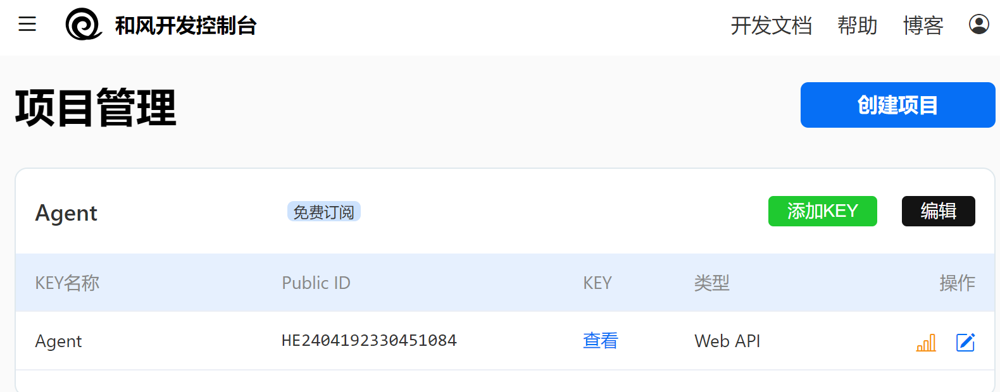 

2.2.3 体验自定义工具效果

与 1.2 部分类似，我们在两个 terminal 中分别启动 LMDeploy 服务和 Tutorial 已经写好的用于这部分的 Web Demo：   
注意，确保 1.1 节中的 LMDeploy 服务以及 1.2 节中的 Web Demo 服务已经停止（即 terminal 已关闭），否则会出现 CUDA Out of Memory 或是端口已占用的情况！   

```
conda activate agent
lmdeploy serve api_server /root/share/new_models/Shanghai_AI_Laboratory/internlm2-chat-7b \
                            --server-name 127.0.0.1 \
                            --model-name internlm2-chat-7b \
                            --cache-max-entry-count 0.1
```

```
export WEATHER_API_KEY=c494eb4ac4c0456a9211411e7095938d
# 比如 export WEATHER_API_KEY=1234567890abcdef
conda activate agent
cd /root/agent/Tutorial/agent
streamlit run internlm2_weather_web_demo.py --server.address 127.0.0.1 --server.port 7860
# 比如 export WEATHER_API_KEY=1234567890abcdef
conda activate agent
cd /root/agent/Tutorial/agent
streamlit run internlm2_weather_web_demo.py --server.address 127.0.0.1 --server.port 7860
```

并在本地执行如下操作以进行端口映射：    

```
ssh -CNg -L 7860:127.0.0.1:7860 -L 23333:127.0.0.1:23333 root@ssh.intern-ai.org.cn -p 44315
```

接下来在本地的浏览器页面中打开 http://localhost:7860 以使用 Lagent Web Demo。首先输入模型 IP 为 `127.0.0.1:23333`，在输入完成后按下回车键以确认。并选择好工具`WeatherQuery`后，就可以开始体验了。    
下图是一个例子： 

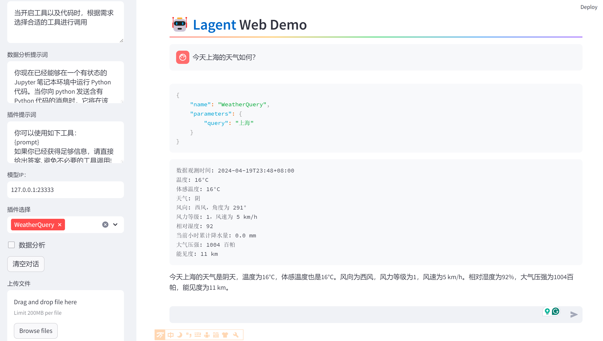 

体验下来，只能查询当天的天气，不能查未来或是过去的天气：

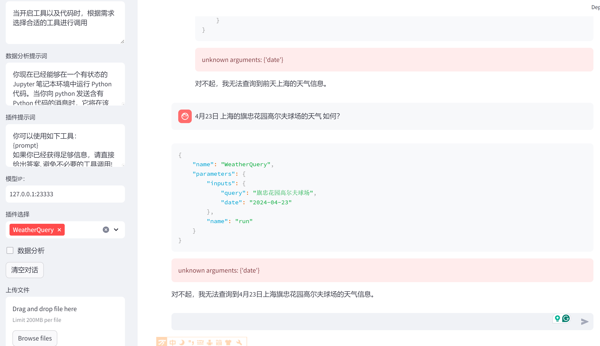 

### 3. AgentLego：组装智能体“乐高”    

在这一部分中，我们将直接使用 AgentLego 工具，体验 AgentLego 的 WebUI，以及基于 AgentLego 自定义工具并体验自定义工具的效果。    

详细文档可以访问：[AgentLego：组装智能体“乐高”](https://github.com/InternLM/Tutorial/blob/camp2/agent/agentlego.md)

### 4. Agent 工具能力微调   

在这一部分中，我们将介绍 OpenAI Function Calling 的相关内容，以及带大家使用 XTuner 来实现 Agent 工具能力的微调。   
详细文档可以访问：[Agent 工具能力微调](https://github.com/InternLM/Tutorial/blob/camp2/agent/finetune.md)   

# 第6课 作业        


